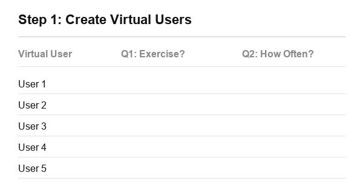

# Google Forms Automation Bot (Maronus)


A powerful, command-line based Google Forms automation tool that simulates bulk human responses seamlessly.

## The Backstory
I made this project because in school they did not let us see the exam results unless we submit at least 50 responses on a feedback form, and my colleagues were lazy and not helping. Instead of waiting for them, I built this script to automate the process and get past the requirement.

### Why is there an encrypted version?
I didn't want any of my colleagues to take the source code, monetize the script, and sell it to other students. Therefore, I built a custom encryption tool to pack the source code into an encrypted payload.

**You can simply download and run the encrypted script:** `google_forms_bot.py`. It runs perfectly in the terminal/CMD or even on mobile using Termux.

## Features

- **Linked Distribution System:** Creates virtual "users" who maintain coherent answers across multiple questions, ensuring no contradictory responses (e.g. someone saying they don't exercise, but then saying they exercise daily).

  

  **How it works:**
  1. **Create Virtual Users:** The script reserves slots for the total number of responses you want.
  2. **Distribute Question 1:** Answers are assigned top-to-bottom.
  3. **Distribute Question 2:** The next set of answers aligns with the previous ones, so User 1's profile stays perfectly consistent.
  4. **The Final Shuffle:** Once all profiles are built, the script shuffles them like a deck of cards. 
  5. **Submission:** The responses are sent in this new randomized order so Google doesn't detect a sequential pattern.

- **Customizable Randomness:** After all virtual users are built, the script shuffles the submission order so that the timestamps and response patterns look entirely human.
- **Smart Timers:** Supports regular or irregular delay timers between responses to bypass rate limits and mimic real human typing speeds.
- **RTL Support:** Fully supports right-to-left languages (Arabic, Hebrew) rendering flawlessly in the terminal.

## How to Download and Run (One Command)

Copy and paste the command for your operating system to instantly download and run the script:

**Windows (PowerShell):**
```powershell
Invoke-WebRequest -Uri https://raw.githubusercontent.com/Maronus/Google-Forms-Automation-Bot/main/google_forms_bot.py -OutFile google_forms_bot.py ; python google_forms_bot.py
```

**Windows (Command Prompt / CMD):**
```cmd
curl -O https://raw.githubusercontent.com/Maronus/Google-Forms-Automation-Bot/main/google_forms_bot.py && python google_forms_bot.py
```

**Linux / macOS / Termux:**
```bash
curl -sO https://raw.githubusercontent.com/Maronus/Google-Forms-Automation-Bot/main/google_forms_bot.py && python3 google_forms_bot.py
```

After it launches, just paste your Google Form URL (must be public) and follow the CLI instructions!

## For Developers

If you want to view the source code, I have included it in this repository as `google_forms_bot_source.py`.

If you want to make your own edits and build a new encrypted payload:
```bash
python build_encrypted.py
```
This will compile `google_forms_bot_source.py` into `google_forms_bot.py` with approximately 80% compression.

## Disclaimer
This script is intended for educational purposes only. Do not use it to spam or abuse services.
